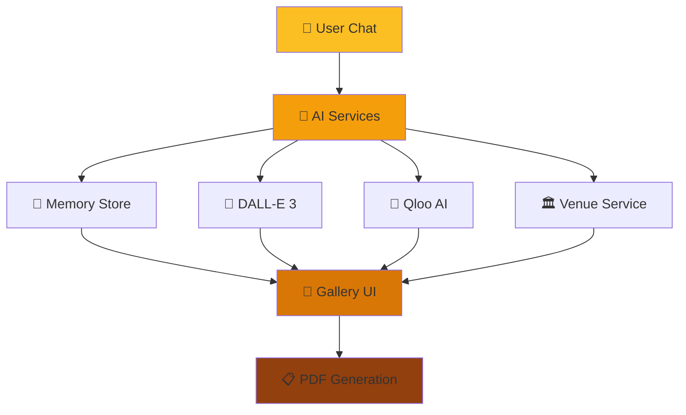

<div align="center">

# ✨ Tiles
*Warm, minimal, intentional*

[](https://qloo.com)
[](https://qloo.com)
[](https://react.dev)
[](https://fastapi.tiangolo.com)

**An AI-powered visual discovery platform built for the Qloo AI Hackathon**

*Where intelligent event planning meets beautiful design*

[🚀 Live Demo](#) • [📖 Documentation](#quick-start) • [🎯 Features](#what-makes-tiles-special)

</div>

---

## 🌟 What Makes Tiles Special

**Tiles** isn't just another gallery app—it's a **smart event planning platform** that uses conversational AI to naturally collect your ideas and transform them into stunning visual experiences. Think Pinterest meets ChatGPT, powered by **Qloo AI's cultural intelligence**.

### 🎭 The Magic Behind Tiles

```
💬 "I want to plan a birthday party in Brooklyn for 20 people"
    ↓ ✨ AI extracts: location, guest count, event type
    
🎨 Generates custom imagery with Azure DALL-E 3
🎵 Finds culturally relevant music via Qloo + YouTube  
🏛️ Recommends perfect venues using location intelligence
📋 Creates comprehensive event PDF with all details
```

<div align="center">

### 🏆 **Built for Qloo AI Hackathon 2024**
*Showcasing the future of intelligent content discovery and personalization*

</div>

---

## 🎯 Core Experience

<table>
<tr>
<td width="50%">

### 💬 **Conversational AI**
- Natural language event planning
- Smart data extraction from chat
- Contextual follow-up questions
- Memory across conversations

</td>
<td width="50%">

### 🎨 **Visual Intelligence** 
- Custom event imagery generation
- Pinterest-style gallery layout
- Real-time content updates
- Adaptive visual recommendations

</td>
</tr>
<tr>
<td width="50%">

### 🎵 **Cultural Intelligence**
- Qloo AI music recommendations
- Location-aware suggestions
- YouTube integration
- Genre and mood matching

</td>
<td width="50%">

### 🏛️ **Smart Venue Discovery**
- Intelligent venue recommendations
- Business ratings and reviews
- Location-based filtering
- Event-type matching

</td>
</tr>
</table>

---

## 🚀 Quick Start

### Prerequisites
```bash
Node.js 18+ • Python 3.8+ • Git
```

### 🎨 Frontend Setup
```bash
cd tiles-frontend
npm install
npm run dev          # Starts on http://localhost:5173
```

### 🤖 Backend Setup  
```bash
cd mockapi
python main.py       # Starts on port 3001
```

### 🔑 Environment Configuration
Create `.env` in `mockapi/`:
```env
# Core AI Services
OPENAI_API_KEY=your_openai_key
AZURE_OPENAI_API_KEY=your_azure_key
AZURE_OPENAI_ENDPOINT=your_azure_endpoint

# Qloo AI (Cultural Intelligence)
QLOO_API_KEY=your_qloo_key
QLOO_API_URL=https://hackathon.api.qloo.com/

# Content Sources
YOUTUBE_API_KEY=your_youtube_key
UNSPLASH_ACCESS_KEY=your_unsplash_key

# AWS (for deployment)
AWS_ACCESS_KEY_ID=your_aws_key
AWS_SECRET_ACCESS_KEY=your_aws_secret
AWS_REGION=us-east-1
```

---

## 🏗️ Architecture

<div align="center">



</div>

### 🎯 **Frontend Architecture**
- **React 19**: Latest features for optimal performance
- **Vite**: Lightning-fast development
- **TailwindCSS**: Utility-first styling with amber theme
- **Framer Motion**: Smooth animations
- **Modular Components**: Sidebar, Chat, Gallery integration

### 🚀 **Backend Architecture**
- **FastAPI**: Async Python web framework
- **Modular Services**: AI, Data Collection, Event Planning
- **Memory Store**: Fast in-memory context management
- **DynamoDB**: Persistent storage for production
- **Serverless Ready**: AWS Lambda compatible

### 🧠 **AI Integration**
- **OpenAI GPT-3.5**: Conversational interface
- **Azure DALL-E 3**: Custom image generation
- **Qloo AI**: Cultural intelligence and recommendations
- **YouTube API**: Music playlist integration
- **Smart Context**: Persistent learning across sessions

---

## 🎨 Visual Design Language

<div align="center">

### 🌅 **Warm Amber Palette**
 `Primary`  `Secondary`  `Accent`  `Deep`

</div>

- **Typography**: Pacifico for branding, clean sans-serif for content
- **Spacing**: Generous whitespace with intentional density
- **Animations**: Subtle, spring-based transitions
- **Glass Morphism**: Frosted glass effects with backdrop blur
- **Responsive**: Mobile-first design with elegant scaling

---

## 🔮 Advanced Features

### 🧠 **AI Memory System**
```typescript
// Persistent context across conversations
const memory = {
  extractedData: { location: "Brooklyn", guests: 20 },
  generationState: { hasGenerated: true },
  conversationHistory: [...messages],
  userPreferences: { style: "modern", budget: "mid-range" }
}
```

### 🎯 **Smart Data Collection**
- **Progressive Enhancement**: Builds detailed profiles through conversation
- **Context-Aware Validation**: Ensures data quality and completeness  
- **Natural Extraction**: No forms—just natural conversation

### 🌐 **AWS Serverless Deployment**
- **Lambda Functions**: Scalable backend execution
- **DynamoDB**: Global distributed database
- **CloudFormation**: Infrastructure as code
- **API Gateway**: RESTful API management

---

## 🏆 Hackathon Innovation

<div align="center">

### 🎯 **Why This Matters for Qloo AI**

</div>

| **Traditional Approach** | **Tiles with Qloo AI** |
|--------------------------|-------------------------|
| Static event templates | 🎨 Dynamic, personalized experiences |
| Generic recommendations | 🎯 Cultural intelligence-driven suggestions |
| Form-based data entry | 💬 Natural conversation extraction |
| Disconnected tools | 🔗 Integrated planning ecosystem |
| One-size-fits-all | 🌍 Location and culture-aware |

### 🚀 **Technical Achievements**
- ✅ **Real-time AI conversation** with context persistence
- ✅ **Multi-modal content generation** (images, music, venues)
- ✅ **Serverless architecture** with AWS deployment
- ✅ **Cultural intelligence integration** via Qloo API
- ✅ **Modern React 19** with advanced patterns
- ✅ **Production-ready** error handling and fallbacks

---

## 🎭 User Journey

<div align="center">

```
🎯 Discovery → 💬 Conversation → 🎨 Generation → 📋 Planning → 🎉 Execution
```

</div>

1. **🎯 Discovery**: User opens Tiles and sees beautiful curated gallery
2. **💬 Conversation**: Natural chat about event ideas and requirements  
3. **🎨 Generation**: AI creates custom visuals, music, and venue recommendations
4. **📋 Planning**: Comprehensive PDF with all event details generated
5. **🎉 Execution**: User has everything needed for a perfect event

---

## 🛠️ Development Commands

```bash
# Frontend Development
cd tiles-frontend
npm run dev          # Development server
npm run build        # Production build
npm run preview      # Preview production build
npm run lint         # ESLint checks

# Backend Development  
cd mockapi
python main.py       # Local FastAPI server
serverless deploy    # Deploy to AWS Lambda
serverless logs -f api # View deployment logs
```

---

## 🌟 Future Roadmap

### 🎯 **Short Term**
- [ ] Enhanced Qloo AI integration with deeper cultural insights
- [ ] Voice input for hands-free event planning
- [ ] Mobile-optimized progressive web app
- [ ] Advanced analytics dashboard

### 🚀 **Long Term**  
- [ ] Multi-language support with cultural adaptation
- [ ] Collaborative planning with real-time updates
- [ ] Integration with calendar and booking systems
- [ ] AR preview of generated event spaces

---

<div align="center">

## 🤝 Contributing

**We welcome contributions!** This project showcases the potential of AI-powered event planning.

[](https://github.com/victorbash400/Tiles)

---

## 🎉 Acknowledgments

**🙏 Special Thanks**
- **Qloo AI Team** - Revolutionary AI platform that makes this possible
- **OpenAI** - GPT models and DALL-E 3 integration  
- **Unsplash** - Beautiful, high-quality imagery
- **YouTube** - Music and playlist integration
- **React & FastAPI Communities** - Incredible open-source tools

---

<br>

**✨ Built with passion for the Qloo AI Hackathon 2024**

*Tiles represents the future of AI-powered event planning—where technology meets creativity to create unforgettable experiences.*

<br>

[](https://qloo.com)

</div>